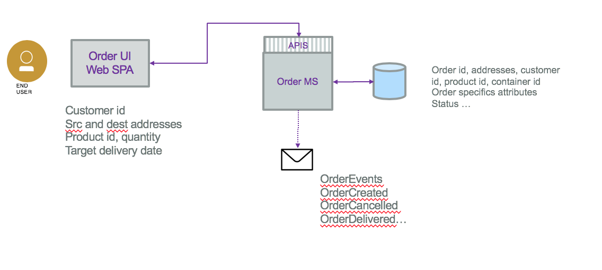
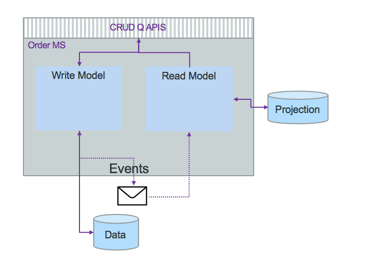
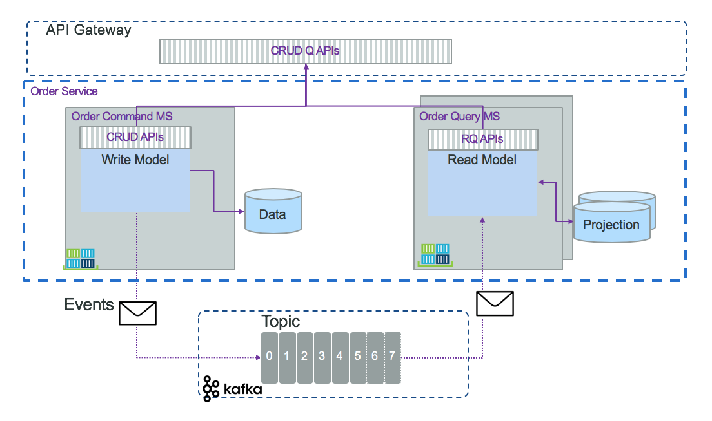
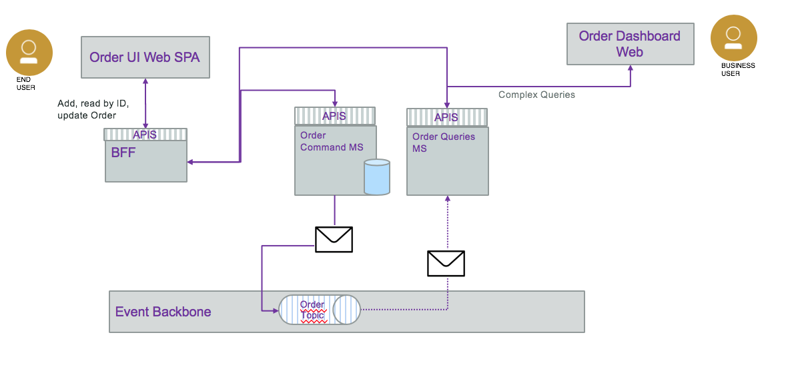
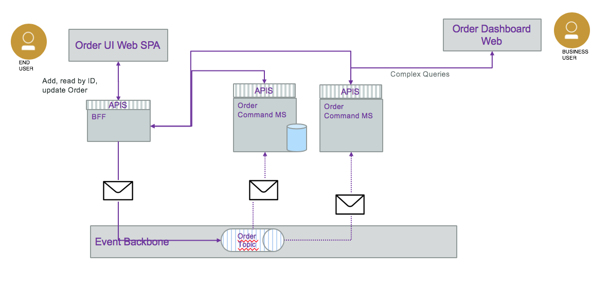

# K Container Shipment Order Management

This project is one reference implementation of the CQRS and event sourcing patterns as part of the [Event Driven Architecture](https://github.com/ibm-cloud-architecture/refarch-eda) reference architecture. From a use case point of view, it implements one of the [K Container shipment process](https://github.com/ibm-cloud-architecture/refarch-kc) microservices. This repository aims to support the order management for the order from the manufacturer to the shipment company. The business process is defined [here](https://github.com/ibm-cloud-architecture/refarch-kc/blob/master/analysis/readme.md).

The goals of the code implemented in this project is to illustrate the event sourcing and CQRS patterns. One of the business requirements for such adoption is to be able to get visibility to the history of order, like being able to respond to questions like:

1. how often a cancellation happens after the order is placed but before an empty container is delivered or loaded ?
1. how often a cancellation happens after the order is placed and container loaded?
1. what has happened to my shipped good over time?  
1. Has the cold chain been protected?

For the first question we need events like OrderPlaced(orderId), OrderCancelled(orderID) and in the read model the OrdersStatuses(orderId, status, timestamp); OrderStatusTransition(orderId, oldStatus, new Status timestamp) and then OrdersCancelledAfterPlaced(orderId, timestamp). We will detailed how to implement those functions in later section.

## User stories
The business requirements and Epics are defined in [this note](https://github.com/ibm-cloud-architecture/refarch-kc#orders-microservice-place-shipment-order---user-story)

The following user stories are done in this project:
- [ ] As a manufacturer manager I want to enter container shipment order information like product reference, quantity (one or more containers),  pickup from address, earliest pickup date, shipment to address,  shipment by date, and required temperature in transit range so the shipping company can give me back an order confirmation ( including the orderID), expected pickup and delivery dates, the assigned voyage and ship name
> As the microservice will not have a dedicated UI, we are using the demonstration UI to define forms to gather the data. So this user story is implemented in the kc-ui project, and in this microservice we need to offer the create and update operations and get by order ID
- [ ] As a manufacturer manager I want to read the status of an order given its order id and receive a report with the full event history of related order, voyage ship and container events. 
> The order id is generated by the order create operation, and is immutable. An order is assigned to a voyage at the time it is created.
- [ ] As a shipment company manager I want to update the status of an order, and add voyage, container and ship information once I know them, also possible modify pickup date and expected delivery date.
- [ ] As a shipment manager I want to be able to assign a shipment request from a customer to a specific voyage in order to create a confirmed order. The selected voyage must be from a source port near the pickup location travelling to a destination port near the delivery location requested by the customer.  It must be within the time window specified by the customer in the order request.  The selected voyage must have free space available ( capacity not previously assigned to other orders) to accomodate the number of containers specified by the customer in their shipment request.  
> Same as above the UI is in kc-ui, so here is a model and the update operation.

## Data and Event Model
By applying a domain-driven design we can identify aggregates, entities, value objects and domain events. Those elements help us to be our information model as classes. For any event-driven microservice you need to assess what data to carry in the event and what persist in the potential data source. 
The following diagram illustrates the different data models in the context of this order microservice:



The Order entered in the User interface is defined like:
```
 class Address {
    street: string;
    city: string;
    country: string;
    state: string;
    zipcode: string;
}

 class Order {
    orderID: string;
    customerID: string;
    pickupAddress: Address;
    destinationAddress: Address;
    productID: string;
    quantity: string;
    expectedDeliveryDate: string;   //  date as ISO format
}
```

The information to persist in the database may be used to do analytics, and get the last status of order. It may look use relational database and may have information like:

```
 class Address {
    street: string;
    city: string;
    country: string;
    state: string;
    zipcode: string;
}

 class Order {
    orderID: string;
    customerID: string;
    pickupAddress: Address;
    destinationAddress: Address;
    productID: string;
    quantity: string;
    expectedDeliveryDate: string;   //  date as ISO format
    pickupDate: string;   //  date as ISO format
}

class OrderContainers {
    orderID: string;
    containerID: string[];
}
```
On the event side we may generate OrderCreated, OrderCancelled,... But what is in the event payload? We can propose the following structure where type will help to specify the event type and getting a generic payload we can have anything in it.
```
class OrderEvent {
    orderId: string;
    timestamp: string;   //  date as ISO format
    payload: any;
    type: string;
    version: string;
}
```

Also do we need to ensure consistency between those data views? Where is the source of truth? 

In traditional SOA service with application maintaining all the tables and beans to support all the business requirements, ACID transactions support the consistency and integrity of the data, and the database is one source of truth. With microservices responsible  To answer those questions we need to review the event-driven microservice patterns we will use and then we will address data consistency [here](#ihe-consistency-challenge).

## Event Sourcing

Most business applications are state based persistence where an update change the previous state of business entities. When a change needs to be made to the domain the changes are done on the new entities added to the system, the old ones are not impacted. But some requirements need to capture changes from the past history. For example, being able to answer how often something happenned in the past year. Also, it could happen that we need to fix data after a service crash, but which ones were impacted by the updating buggy code?
One way to keep history is to use an audit log. Inside the log, events are persisted. As already said, events represent facts. So **event sourcing** persists the state of a business entity, such an Order, as a sequence of state-changing events. 

Even sourcing only captures the intent, in the form of events stored in the log. To get the final state of an entity, the system needs to replay all the events, which means replaying the changes to the state but not replaying the side effects. A common side effect is to send a notification on state change to consumers. Sometime it may be too long to replay hundreds of events. In that case we can use snapshot, to capture the current state of an entity, and then replay events from the most recent snapshot. This is an optimization technique not needed for all event sourcing implementations. When state change events are in low volume there is no need for snapshots.

It is important to keep integrity in the log. History should never be rewritten, then event should be immutable, and log being append only.

The event sourcing pattern is well described in [this article on microservices.io](https://microservices.io/patterns/data/event-sourcing.html). It is a very important pattern for EDA and microservices to microservices data synchronization needs.

See also this nice [event sourcing article](https://martinfowler.com/eaaDev/EventSourcing.html) from Martin Fowler, where he is also using ship movement example. Our implementation differs here and we are using Kafka topic as event store and use the Order business entity.

### Command sourcing

Command sourcing is a similar pattern as the event sourcing one, but the commands that modify the states are persisted instead of the events. This allows commands to be processed asynchronously, which can be relevant when the command execution takes a lot of time.
One derived challenge is that the command may be executed multiple times, specially in case of failure. Therefore, it has to be idempotent. Finally, there is a need also to perform validation of the command to avoid keeping wrong commands in queue. For example, AddItem command is becoming AddItemValidated, then once persisted to a database it becomes ItemAdded. 

## Command Query Responsibility Segregation (CQRS) pattern

When doing event sourcing and domain driven design, we event source the aggregates or root entities. Aggregate creates events that are persisted. On top of the simple create, update and read by ID operation, the business requirements want to perform complext queries that can't be answered by a single aggregate. By just using event sourcing to be able to respond to a query like what are the orders of a customer, then we have to rebuild the history of all orders and filter per customer. It is a lot of computation. This is linked to the problem of having conflicting domain model between query and persistence.  
Command Query Responsibility Segregation, CQRS, separates the read from the write model. The following figure presents the high level principles:



The service exposes CUD operations, some basic Read by Id and then queries APIs. The domain model is splitted into write and read models. Combined with Event Sourcing the write model goes to the event store. Then we have a separate process that consumes those events and build a projection for future queries. The write part can persist in SQL while the read could use Cassandra, they do not need to be in the same language. With CQRS amd ES the projecttions are retroactive. New query equals implementing new projection and read the events from the beginning of time or the recent snapshot. Read and write models are strongly decoupled anc can evolve independently. It is important to note that the Command part can still handle simple queries, primary-key based, like get order by id, or queries that do not involve joins.

With this structure the Read model microservice will most likely consume events from multiple topics to build the data projection based on joining those data. A query to assess if the cold-chain was respected on the fresh food order shipment will go to the voyage, container metrics, and order to be able to answer this question. This is in this case that CQRS shine.

A second view of the previous diagram presents how we can separate the AI definition and management in a API gateway, the Order command and write model as its own microservice, the event sourcing supported by a Kafka topic, and the query - read model as microservices or event function as a service:



The CQRS pattern was introduced by [Greg Young](https://www.youtube.com/watch?v=JHGkaShoyNs), https://martinfowler.com/bliki/CQRS.html https://microservices.io/patterns/data/cqrs.html

As soon as we see two arrows from the same component we have to ask ourselves how does it work: the write model has to persist Order in its own database and then send OrderCreated event to the topic... Should those operations be atomic?

### The consistency challenge

As introduced in previous section there is potentially a problem of data consistency: the command part saves the data into the database and is not able to send the event to the topic, then consumers do not see the new or updated data.  
With traditional Java service, using JPA and JMS, the save and send operations can be part of the same transaction and both succeed or both failed.
With even sourcing pattern, the source of trust is the event source. It acts as a version control system. So the service should start by creating the event (1) and then to persist the data into the database, it uses a consumer filtering on create or update order event (2). It derives state solely from the events. If it fails to save, it can persist to an error log the order id (4) and then it will be possible to trigger the replay via an admin API (5,6) using a search in the topic the OrderCreated event with this order id to replay the save operation. Here is a diagram to illustrate that process:


This implementation brings a problem on the createOrder(order): order operation, as the returned order was supposed to have the order id as unique key, so most likely, a key created by the database... To avoid this we can generate the key by code and enforce this key in the database if it supports it. 

There are other ways to support this dual operations level:

* There is the open source [Debezium tool](https://debezium.io/) to help respond to insert, update and delete operations on database and generate event accordingly. It may not work on all database schema. 
* Write the order to the database and in the same transaction write to a event table. Then use a polling to get the event to send to kafka from this event and delete it in the table once sent. 
* Use the Capture Data Change from the database transaction log and generate events from this log. The IBM [Infosphere CDC](https://www.ibm.com/support/knowledgecenter/cs/SSTRGZ_10.2.0/com.ibm.cdcdoc.mcadminguide.doc/concepts/overview_of_cdc.html) product helps to achieve that.

What is important to note is that the event need to be flexible on the data payload.

On the view side, updates to the view part need to be indempotent. 

### Delay in the view

There is a delay between the data persistence and the availability of the data in the Read model. For most business applications it is perfectly acceptable. In web based data access most of the data are at stale. 

When there is a need for the client, calling the query operation, to know if the data is up-to-date, the service can define a versioning strategy. When the order data was entered in a form within a single page application like our [kc- ui](https://github.com/ibm-cloud-architecture/refarch-kc-ui), the create order operation should return the order with the id created and the SPA will have the last data.

### Schema change

What to do when we need to add attribute to event?. So we need to create a versioninig schema for event structure. You need to use flexible schema like json or [protocol buffer](https://developers.google.com/protocol-buffers/) and may be and event adapter (as a function?) to translate between the different event structures.

## How to build and run

Each microservice has a build script to perform the maven package and build the docker image. See `scripts` folder.

* For order-command-ms
 ```
 ./scripts/buildDocker.sh
 ```
 * For order-query-ms
 ```
 ./scripts/buildDocker.sh
 ```

## How we implemented it

There are different possible design approaches to use event sourcing. The following diagram illustrates the CQRS and event sourcing as well as the Saga pattern as the order command service is persisting order in its own datasource before creating event. The query part is a consumer of event and build projections to support the different queries:



The BFF is using the API of the order services to get create or update orders and perform complex queries. 

Using this model helps to encapsulate the order mananagement in the boundary of a reusable service.

The alternate is to have the BFF pushing events to the event source and then having the order service consuming event to persist them.



As the BFF still need to get order by ID or perform complex query it has to access the order service. The responsability is splitted and if CQRS is not a viable pattern in long term, the BFF code needs to be modified. It is also simpler for the BFF to do HTTP calls than posting to kafka topic.

## Contribute

As this implementation solution is part of the Event Driven architeture reference architecture, the [contribution policies](./CONTRIBUTING.md) apply the same way here.

**Contributors:**
* [Jerome Boyer](https://www.linkedin.com/in/jeromeboyer/)
* [Edoardo Comar](https://www.linkedin.com/in/edoardo-comar/)
* [Jordan Tucker](https://www.linkedin.com/in/jordan-tucker-ba328a12b/)
* [Mickael Maison](https://www.linkedin.com/in/mickaelmaison/)
* [Francis Parr](https://www.linkedin.com/in/francis-parr-26041924)

