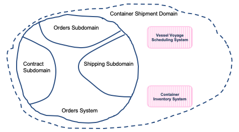
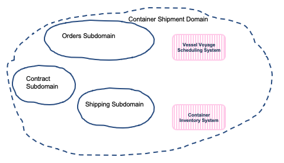

# Domain-driven design applied to order context

During the event storming analysis, we define the domain to be the container shipment domain. It groups a set of subdomains like orders, contract, shipping, and external systems as the voyage scheduling and the container inventory management:

Notice that at this time just three physical systems exist. The grouping of the orders, contract and shipping in one boundary context was an analysis shortcut as we want to clearly separate them as the owner ship and ubiquituous language are differents. We have three subdomain and all can be considered core domains. They are competitive advantages and directly impact the organization business.

The order subdomain interacts with the contract subdomain via acceptance of the contract conditions from the customer and by build a contract from the created order. 

When the contract is accepted, the order needs to be shipped, but to do so the shipping subdomain needs to interact with the voyage subsystem to get the available voyage from the closed harbor from the pickup destination, to a target harbor to the shipping destination. It also needs to interact with the container inventory service to get a matching container. 

## Bounded Contexts

Within a business context every use of a given domain term, phrase, or sentence, **the Ubiquitous Language** inside the boundary has a specific contextual meaning. So order context is a boundary context and addresses order, ordered product type, pickup and shipping addresses. The business problem to address is how to make order traceability more efficient so customers have a clear view of their orders.
 
An order will be assigned to one or many containers and containers are assigned to a voyage.

## User stories

The business requirements is presented in [this note](https://ibm-cloud-architecture.github.io/refarch-kc/analysis/readme/)

The following user stories are done in this project:

- [ ] As a manufacturer manager I want to enter container shipment order information like product reference, quantity,  pickup from address, earliest pickup date, shipment to address,  shipment by date, and required temperature in transit range so the shipping company can give me back an order confirmation ( including the orderID), expected pickup and delivery dates, the assigned voyage and ship name
> As the microservice will not have a dedicated UI, we are using the demonstration UI to define forms to gather the data. So this user story is implemented in the kc-ui project, and in this microservice we need to offer the create and update operations and get by order ID
- [ ] As a manufacturer manager I want to read the status of an order given its order id and receive a report with the full event history of related order, voyage ship and container events. 
> The order id is generated by the order create operation, and is immutable. An order is assigned to a voyage at the time it is created.
- [ ] As a shipment company manager I want to update the status of an order, and add voyage, container and ship information once I know them, also possible modify pickup date and expected delivery date.
- [ ] As a shipment manager I want to be able to assign a shipment request from a customer to a specific voyage in order to create a confirmed order. The selected voyage must be from a source port near the pickup location travelling to a destination port near the delivery location requested by the customer.  It must be within the time window specified by the customer in the order request.  The selected voyage must have free space available ( capacity not previously assigned to other orders) to accomodate the number of containers specified by the customer in their shipment request.  
> Same as above, the UI is in kc-ui project, so here is a model and the update operation.