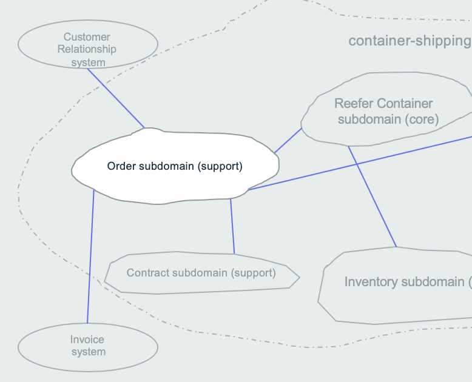
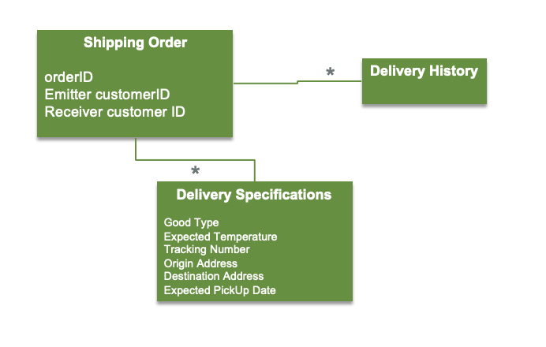
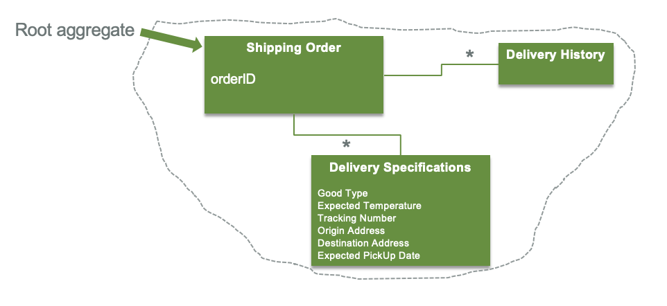
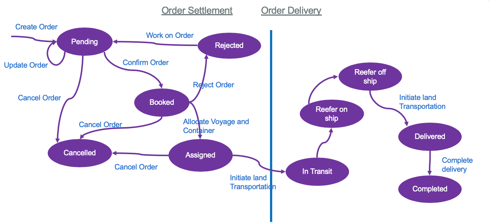
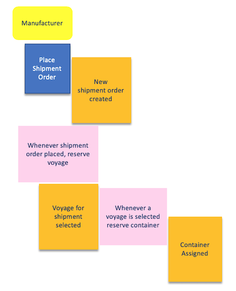

The event storming workshop helped us to engage with the business experts and understand the end to end reefer shipping process as well as the events created. The following diagram represents part of this work: (It may have evolved a little bit as we worked with domain experts to learn about the domain)

We assume you are now familiar with the event storming methodology as presented in [this note](http://ibm-cloud-architecutre.github.io/refarch-eda/methodology/eventstorming.md). And you have some basic knowledge of domain driven design, from reading books like [Eric Evans's "Domain Driven Design: Tackling Complexity in the Heart of Software" book]( https://learning.oreilly.com/library/view/domain-driven-design-tackling) and reading our summary in [this note](https://ibm-cloud-architecture.github.io/refarch-eda/methodology/ddd/)

We recommend to read the note ["From analysis to implementation"](https://ibm-cloud-architecture.github.io/refarch-kc/design/readme/) to get a clear understanding of the application design and the ubiquituous language of the reefer shipping domain.

In this part we focus on the order sub-domain.

The order subdomain interacts with the contract subdomain via the acceptance of the contract conditions from the customer (e.g. manufacturer) and by building a contract from the created shipment order. We are not addressing contract in this solution.

When the contract is accepted, the order needs to be shipped, but to do so the shipping subdomain needs to interact with the voyage subsystem to get the available vessel itineraries. Voyage is an entity grouping the information about the origin harbor close to the pickup address, to a destination harbor the closest to the shipping address. Finally, the shipping subdomain needs to interact with the container inventory service to get matching Reefer containers, present at the source harbor. 

## Ubiquitous language

### Entities and Value Objects

**Order** is the main business entity of this service, and is uniquely identified by its orderID. The orderID is sequentially created when persisting it in its repository. The OrderID will be communicated asynchronously to the customer via a confirmation email.

The order request specifies: 

* The pickup location where empty container will be loaded 
* The delivery location where the container is to be delivered to (we expect this to be in a remote country requiring a sea voyage) 
* The type of good with the target temperature to maintain during the travel.
* The shipment time window i.e.:  
    * Earliest date at which goods are available at pickup location for loading into the container 
    * Date by which delivery to the destination address is required   

All those information are becoming value objects:

* the different addresses
* delivery specifications
* deliver history

The delivery history implementation will be support via event sourcing and queries.

### Aggregate boundaries

In Domain-driven design, an aggregate groups related object as a unique entity. One object is the aggregate root. It ensures the integrity of the whole. Here the root is the Shipping Order. The product to ship is part of the aggregate. The Shipping Order is what we will persist in one unique transaction. 

In this project we focus on the **shipping order** aggregate with two microservices: one for the write model and one for the queries.

### Shipment order lifecycle and state change events 

It is important to assess the business entity life cycle to assess state and events to be produced as part of the state transition. The following diagram illustrates a potential life cycle for the shipping order aggregate:

A shipment order is initially created with an API call made by a customer, or via a user interface the customer uses to enter information (the demonstration user interface is simulating the form entry).  

When a new shipment order is placed, the shipping company must determine whether there is available capacity in some planned ship voyage which meets all the requirements specified by the customer. If there is a planned voyage with available capacity for additional container going from the source port nearest the pickup location to the destination port nearest to the delivery location, and a Reefer container is found then the order can transition to `state=ASSIGNED` and positive confirmation of the order returned to the requester. If no such voyage is available then the shipment order transitions to `state=REJECTED` (No Availability) and this is reported back to the requester, and the shipping company clerk will work with the customer to find a solution: the process is manual. 

We assume that the shipping company always has enough container available to meet expected shipment demand. 

Since the scope for this demonstration build excluded the simulation of trucking operations to get the goods from the manufacturer's pickup location, export clearance and actual dockside loading operations, once an order has a container allocated it is "ready to go" and transitions to `state=IN_TRANSIT`.  

The actual event of recording the container as being on board ship and at sea will not happen until simulated time in the demonstration reaches the scheduled start of the voyage on which that container is booked and the container ship assigned to that voyage is in the source port and also ready to go. At that point in simulated time, the state of the shipment order changes from `state =IN_TRANSIT` to `state = CONTAINER_ON_SHIP`.

While the order has `state = CONTAINER_ON_SHIP`, then we will be receiving temperature information from the Reefer container simulation and Ship position information from the ship simulation service. Both provide a continuous streaming sources of information which should be considered part of the extended shipment state. 

After some period of simulated time, the ship will reach the destination port of the voyage. At this time the order transitions to `state = CONTAINER_OFF_SHIP` since our scope excluded simulation of actual dockside unloading information. Since we are not modelling customs clearance or trucking operations, there are no further events to be modeled until the order `state = CONTAINER_DELIVERED`. 

Since we are not modelling invoicing and billing operations the Container can be deallocated from this order and returned to some pool of free containers. When that has occurred the order state can be considered `state = ORDER_COMPLETED`. 

We have described the nornal, exception-free path first. There are two exception cases modelled:  

* At the time a new shipment order is requested, there may be no voyage with available capacity meeting the location and time requirements of the request. When this occurs, the manufacturer/user is informed and the order state becomes `state= REJECTED` (No Availability). At this point, the user can modify the order with a second API requests changing dates or possibly locations. This retry request could still fail returning the order back to `state = REJECTED` ( No availability). Alternatively the changes in dates and location could be enough for an available voyage to be found. When this occurs the order will transition to `state = BOOKED` modified. 
* If an API call to modify an order is made and the order is in some state different from `state = REJECTED` (No availability), we reject the API request. There could be race conditions, the order is in the process of being assigned to a voyage, or complex recovery issues. What if the order is already in a container and at sea when a modify order is received ?  Full treatment of these complex business specific issues is out of scope and avoided by the state check in the modify order call API call
* We also model the exception condition when the refrigeration unit in a container fails or is misset or over loaded. If the temperature in the container goes outside the service level range for that shipment the goods must be considered spoiled.  The order will transition from `state = CONTAINER_ON_SHIP` to  `state = ORDER_SPOILED` (Temperature out of Range). Some complex business recovery such as compensating the customer and possibly scheduling a replacement shipment may be required. The details will be contract specific and outside the scope, but we do include the use of Streaming event container analytics to detect the spoilage and use rule based real-time /edge adjustments of the refrigeration gear to avoid spoilage in the demonstration simulation.

### Repositories

The Order aggregate has its own repository. 

### Command - Policies and Events

When adding commands and business policies to the discovered events, we are able to isolate the following commands and events for the order context.

Those command will become verbs for the order command APIs: 

* Place a new shipment order.    
* Modify an order request which could not be booked within the requested time window.  
* Confirm shipping order conditions
* Define contract conditions
* Assign voyage
* Assign reefer container
* Cancel order
* Initiate land transportation

## CRQS and event sourcing

From the requirements toget a clear understanding of what happen overtime to the shipping order and the fresh cargo, we will adopt an event based solution with event sourcing capability. As we need to join data between different microservices, and we do not know yet the full scope of complex queries the business team wants to do in the future, we opt to implement CQRS for this order microservice.

* The demand for order tracking might have significantly more intense scalability needs than order commands. Orders are typically created once and changes state a handful of times. There could be many different users querying status of a particular orders independently and each requesting tracking multiple times for each order to determine if there is some delay expected.
* Order state tracking information should probably be organized by requesting customer NOT by order ID:   
    * since customers should be allowed to see status on their own orders but not on other customer's orders 
    * when the shipping company is tracking an order it is most frequently doing so on behalf of a specific customer  
With this approach orders-query-ms becomes a CQRS query service with internal state updated from the event backbone, and an order tracking API.

## User stories

The business requirements is presented in [this note](https://ibm-cloud-architecture.github.io/refarch-kc/analysis/readme/) but we will not implement all this end to end process and all the capabilities we just want to select the following user stories:

- As a shipping company manager, I want to get the current newly created order list so that I can create contract manually. (the contract creation is out of scope, but the list of orders is in)
- As a shipping company manager, I want to get a specific order knowing its unique identifier so that I can review the data and know the current status.
- As a shipping company manager, I want to update the status of an order, cancel it or complete it
- As a shipping company manager, I want select one of the proposed voyages, so that I can optimize the vessel allocation, and satisfy the customer.
- As a shipping company manager, I want to review the reefer containers allocated to the order because I'm curious
- As a shipping company manager, I want to modify pickup date and expected delivery date to adapt to customer last request
 
The selected voyage must be from a source port near the pickup location travelling to a destination port near the delivery location requested by the customer.  It must be within the time window specified by the customer in the order request.  The selected voyage must have free space available (capacity not previously assigned to other orders) to accomodate the number of containers specified by the customer in their shipment request. From a design point of view we can imagine there is an automatic system being able to perform this assignment. This is implemented in the [Voyage microservice](https://ibm-cloud-architecture.github.io/refarch-kc-ms)

!!! warning
    All the end user interactions are done in the user interface, in a separate project, but the order microservice supports the backend operations.

At this stage we have identified the bounded context, the aggregates, the commands and events we need to implement for this order management service. The implementation involves at least two microservices, one of the command and one for the query. The implementation details are explained in [this note.](#implementation-considerations.md)