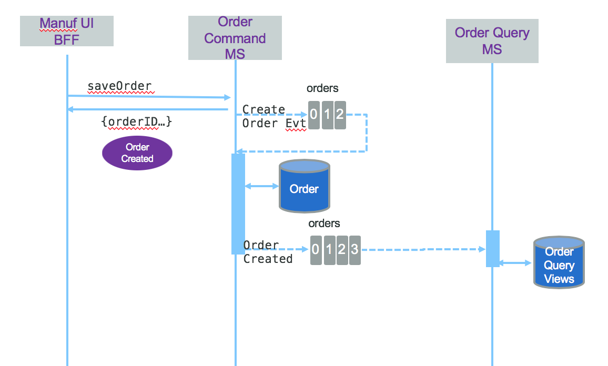

# K Container Shipment Order Management Service

This project is demonstrating, one of the possible implementation of the Command Query Responsibility Segregation and event sourcing patterns applied to container shipment management service. It is part of the [Event Driven Architecture](https://ibm-cloud-architecture.github.io/refarch-eda) reference architecture. From a use case point of view, it implements the order management component, responsible to manage the full life cycle of an order issued by a manufacturer who want to ship fresh goods overseas. The business process is defined [here](https://ibm-cloud-architecture.github.io/refarch-kc/introduction/).

One of the business requirements for adopting event sourcing and CQRS patterns is to be able to get visibility to the history of orders and track the good shipment progress over time. This would include the ability to determine: 

1. How frequently does an order get cancelled after it is placed but before an empty container is delivered to pick up location or loaded ?
1. How often does an order get cancelled after the order is confirmed, a container assigned and goods loaded into it?
1. What are all events for a particular order and associated container shipment?  
1. Has the cold chain been protected on this particular order?
1. How long it takes to deliver a container to pick up location?

To answer those questions we need to keep historical information of each orders and its events. Event sourcing is to pattern of choice for that. 

We are detailing how to go from event storming to implementation in a [separate note](ddd-applied.md) by apply the domain-driven design approach.

 first question we need events like OrderPlaced(orderId), OrderCancelled(orderID) and a read model with OrdersStatuses(orderId, status, timestamp); OrderStatusTransition(orderId, oldStatus, new Status timestamp) and then OrdersCancelledAfterPlaced(orderId, timestamp). We will detail how to implement those functions in later section.

## User stories

The business requirements is presented in [this note](https://ibm-cloud-architecture.github.io/refarch-kc/analysis/readme/)

The following user stories are done in this project:

- [ ] As a manufacturer manager I want to enter container shipment order information like product reference, quantity,  pickup from address, earliest pickup date, shipment to address,  shipment by date, and required temperature in transit range so the shipping company can give me back an order confirmation ( including the orderID), expected pickup and delivery dates, the assigned voyage and ship name
> As the microservice will not have a dedicated UI, we are using the demonstration UI to define forms to gather the data. So this user story is implemented in the kc-ui project, and in this microservice we need to offer the create and update operations and get by order ID
- [ ] As a manufacturer manager I want to read the status of an order given its order id and receive a report with the full event history of related order, voyage ship and container events. 
> The order id is generated by the order create operation, and is immutable. An order is assigned to a voyage at the time it is created.
- [ ] As a shipment company manager I want to update the status of an order, and add voyage, container and ship information once I know them, also possible modify pickup date and expected delivery date.
- [ ] As a shipment manager I want to be able to assign a shipment request from a customer to a specific voyage in order to create a confirmed order. The selected voyage must be from a source port near the pickup location travelling to a destination port near the delivery location requested by the customer.  It must be within the time window specified by the customer in the order request.  The selected voyage must have free space available ( capacity not previously assigned to other orders) to accomodate the number of containers specified by the customer in their shipment request.  
> Same as above, the UI is in kc-ui project, so here is a model and the update operation.

## Implementation approach

As introduced in the [high level design note](https://ibm-cloud-architecture.github.io/refarch-kc/design/readme/) the order life cycle looks like in the following diagram:


The order microservice supports the implementations of this life cycle, using event sourcing and CQRS.

With [CQRS](https://ibm-cloud-architecture.github.io/refarch-eda/evt-microservices/ED-patterns/#command-query-responsibility-segregation-cqrs-pattern) we will separate the 'write model' from the read. The Command microservice implements the write model and exposes a set of REST end points for Creating Order, Updating Order and getting Order per ID. The query service will address complex queries to support adhoc business requirements and joining data between different entities like the order, the containers and the voyages. So we have two Java project to support each service implementation. Each service is packaged as container and deployable to Kubernetes. 

* [Order command microservice](https://github.com/ibm-cloud-architecture/refarch-kc-order-ms/tree/master/order-command-ms)
* [Order query microservice](https://github.com/ibm-cloud-architecture/refarch-kc-order-ms/tree/master/order-query-ms)

As some requirements are related to historical query, using an event approach we need to keep event on what happens to the order. Instead of implementing a complex logic with the query and command services the event sourcing is supported by using Kafka topics. The following diagram illustrates the CQRS and event sourcing applied to the order management service. Client to the REST api, like a back end for front end app, performs a HTTP POST operation with the order data. The command generates event and persist order on its own data source. The query part is a consumer of event and build its own projections to support the different queries:

 

The datasource at the command level, may not be necessary, but we want to illustrate here the fact that it is possible to have a SQL based database or a document oriented database to keep the order last state: a call to get /orders/{id} will return the current order state. 

For the query part the projection can be kept in memory, depending of the amount of data to gather, and the view can be built by re-reading the event store. 

An alternate solution is to have the BFF pushing events to the event source and then having the order service consuming event to persist them, as illustrated in the following diagram:


As the BFF still needs to get order by ID or perform complex query it has to access the order service using HTTP, we could image the BFF developers prefer to use one communication protocol and adding kafka producer was not their cup of tea.  

The following sequence diagram illustrates the relationships between the components.



To avoid transaction between the database update and the event publisher, the choice is to publish the event as soon as it is received and use a consumer inside the command service to load the data and save to the database. This is illustrated in [this article.](https://ibm-cloud-architecture.github.io/refarch-eda/evt-microservices/ED-patterns/#the-consistency-challenge)

The /order POST REST end point source code is [here](https://github.com/ibm-cloud-architecture/refarch-kc-order-ms/blob/6de424c443c05262ae013620f5f11b4a1b2e6f90/order-command-ms/src/main/java/ibm/labs/kc/order/command/service/OrderCRUDService.java#L51-L74)

and the [order events consumer](https://github.com/ibm-cloud-architecture/refarch-kc-order-ms/blob/6de424c443c05262ae013620f5f11b4a1b2e6f90/order-command-ms/src/main/java/ibm/labs/kc/order/command/service/OrderAdminService.java#L35) in the command pattern.

See the class [OrderCRUDService.java](https://github.com/ibm-cloud-architecture/refarch-kc-order-ms/blob/master/order-command-ms/src/main/java/ibm/labs/kc/order/command/service/OrderCRUDService.java).
* Produce order events to the `orders` topic. 
* Consume events to update the state of the order or enrich it with new elements.

When the application starts there is a [ServletContextListener](https://docs.oracle.com/javaee/6/api/javax/servlet/ServletContextListener.html) class started to create a consumer to subscribe to order events (different types) from `orders` topic. When consumer reaches an issue to get event it creates an error to the `errors` topic, so administrator user could replay the event source from the last committed offset. Any kafka broker communication issue is shutting down the consumer loop.

## Data and Event Model

By applying a domain-driven design we can identify aggregates, entities, value objects and domain events. Those elements help us to be our information model as classes. For any event-driven microservice you need to assess what data to carry in the event and what persist in the potential data source. 
The following diagram illustrates the different data models in the context of this order microservice:


The Order entered in the User interface is defined like:
```
 class Address {
    street: string;
    city: string;
    country: string;
    state: string;
    zipcode: string;
}

 class Order {
    orderID: string;
    customerID: string;
    pickupAddress: Address;
    destinationAddress: Address;
    productID: string;
    quantity: string;
    expectedDeliveryDate: string;   //  date as ISO format
}
```

The information to persist in the database may be used to do analytics, and get the last status of order. It may look use relational database and may have information like:

```
 class Address {
    street: string;
    city: string;
    country: string;
    state: string;
    zipcode: string;
}

 class Order {
    orderID: string;
    customerID: string;
    pickupAddress: Address;
    destinationAddress: Address;
    productID: string;
    quantity: string;
    expectedDeliveryDate: string;   //  date as ISO format
    pickupDate: string;   //  date as ISO format
}

class OrderContainers {
    orderID: string;
    containerID: string[];
}
```
On the event side we may generate OrderCreated, OrderCancelled,... But what is in the event payload? We can propose the following structure where type will help to specify the event type and getting a generic payload we can have anything in it.
```
class OrderEvent {
    orderId: string;
    timestamp: string;   //  date as ISO format
    payload: any;
    type: string;
    version: string;
}
```

Also do we need to ensure consistency between those data views? Where is the source of truth? 

In traditional SOA service with application maintaining all the tables and beans to support all the business requirements, ACID transactions support the consistency and integrity of the data, and the database is one source of truth. With microservices responsible to manage its own business entity, clearly separated from other business entities, data eventual consistency is the standard. If you want to read more about the Event Sourcing and CQRS patterns [see this article.](https://ibm-cloud-architecture.github.io/refarch-eda/evt-microservices/ED-patterns)

## How to build and run

### Pre-requisites

You can have the following installed on your computer or use [our docker image](https://github.com/ibm-cloud-architecture/refarch-kc/blob/master/scripts/docker-java-tools) to get those dependencies integrated in a docker image and you can use to build, test and package the java programs.
* [Maven](https://maven.apache.org/install.html)
* Java 8: Any compliant JVM should work.
  * [Java 8 JDK from Oracle](http://www.oracle.com/technetwork/java/javase/downloads/index.html)
  * [Java 8 JDK from IBM (AIX, Linux, z/OS, IBM i)](http://www.ibm.com/developerworks/java/jdk/),
    or [Download a Liberty server package](https://developer.ibm.com/assets/wasdev/#filter/assetTypeFilters=PRODUCT)
    that contains the IBM JDK (Windows, Linux)


### Build

Each microservice has a build script to perform the maven package and build the docker image. See `scripts` folder.

* For order-command-ms
 ```
 ./scripts/buildDocker.sh
 ```
 * For order-query-ms
 ```
 ./scripts/buildDocker.sh
 ```

To build without docker image:

* `mvn install` or `mvn install  -DskipITs` to bypass integration tests, as they need kafka and a running Liberty server

### Run

You can start the Liberty server locally with

* `mvn liberty:run-server`  to start the server with the deployed wars.

Or run the complete solution locally using [docker compose](https://github.com/ibm-cloud-architecture/refarch-kc/blob/master/docker/kc-solution-compose.yml) from the [refarck-kc](https://github.com/ibm-cloud-architecture/refarch-kc) project to start a local kafka broker and all the components:

One time execution of the kafka broker: 

```shell
cd refarch-kc/docker
docker-compose -f backbone-compose.yml up
```

Start the solution

```shell
docker-compose -f bkc-solution-compose.yml up
```

And stop everything:
```
docker-compose -f kc-solution-compose.yml down
docker-compose -f backbone-compose.yml down
```

